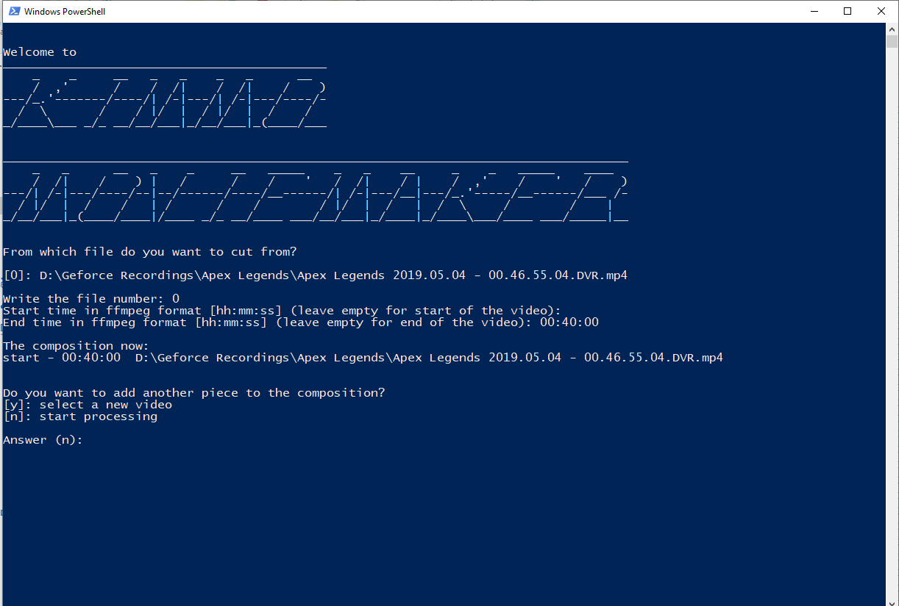

# KIMMO MOVIEMAKER 🎥

Powershell and ffmpeg glue for concatenating videos. Created for situations where you want to simply cut parts of bunch of videos and concatenate them to a new single video.

## Usage

Drag the source videos into the kimmomoviemaker shortcut in File Explorer and follow instructions.

## Install

* Install Powershell
* Install ffmpeg

After that, create a new shortcut in file explorer which has target set as `powershell.exe -File "C:\Path To Your\kimmo-moviemaker\concat.ps1`. After that, dragging files into it is possible and they will be passed as arguments to the powershell script.

## Useful links

* https://stackoverflow.com/questions/45004159/ffmpeg-ss-and-t-for-cutting-mp3
* https://stackoverflow.com/questions/7333232/how-to-concatenate-two-mp4-files-using-ffmpeg
* https://superuser.com/questions/106360/how-to-enable-execution-of-powershell-scripts
* http://ffmpeg.org/download.html
 
